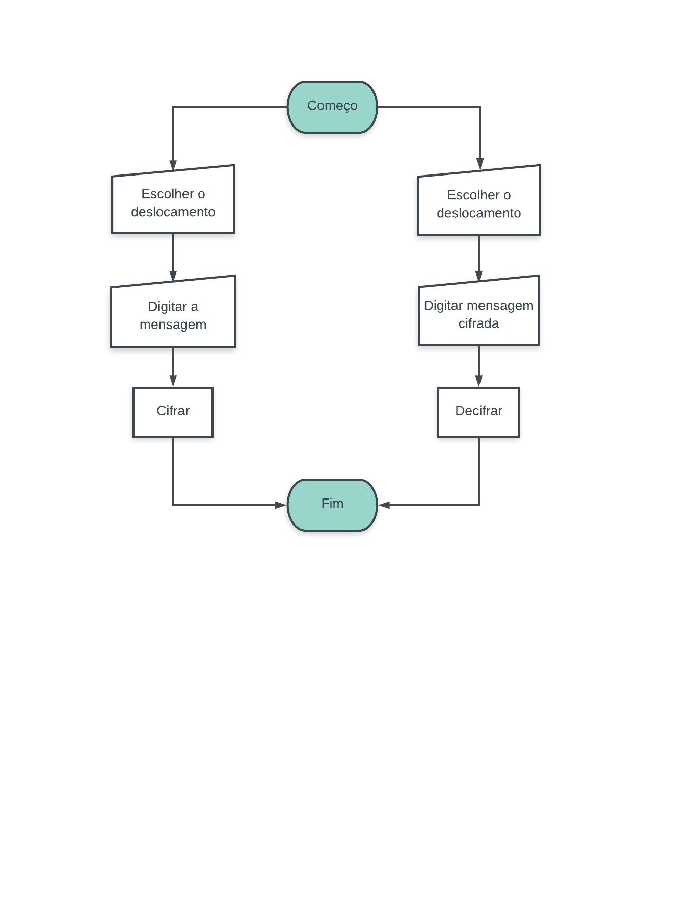

# Cifra de César

## Prefácio

O aniversário da sua mãe está se aproximando e você está organizando uma festa
surpresa. Para manter a festa em segredo foi criado um grupo de Whatsapp com
amigxs e familiares. O problema é que as vezes sua mãe utiliza o seu celular
e pode ser que ela veja as suas mensagens. Como a festa é surpresa, você
decide criar uma aplicação que permita enviar mensagens criptografadas e depois
descriptografar. 

## Introdução

Para o desenvolvimento do sistema foi utilizado JavaScript. O programa funciona de modo simples e direto, onde a mensagem inserida pelo usuário passa por um método que cifra ou decifra a mensagem de acordo com a escolha da chave de deslocamento, retornando um novo texto.

### Desenvolvimento

1) Criar uma função "cipher" para criptografar a mensagem inserida:

. Função (encodeCipher) criptografa, um parâmetro com a mensagem e outro com o deslocamento.
. if e else identifica letras maiúsculas e minúsculas e seus respectivos números correspondentes na tabela ASCII.
. Fórmula da cifra de cesar para criptografar a mensagem inserida.
. O usuário recebe a mensagem cifrada.

2) Criar a função "decipher" para descriptografar a mensagem inserida:

. Função (decodeCipher) descriptografa, um parâmetro com a mensagem e outro com o deslocamento.
. if e else identifica letras maiúsculas e minúsculas e seus respectivos números correspondentes na tabela ASCII, fazendo o caminho inverso.
. Fórmula da cifra de cesar para descriptografar a mensagem inserida.
. O usuário recebe a mensagem decifrada.

## Fluxograma

## Conclusão

 * [x] README.md com explicações e desenho do projeto
 * [x] Usar VanillaJS.
 * [x] Permitir escrever um texto, com letras maiúsculas e minúsculas, para ser cifrado.
 * [x] Mostrar o resultado da cifra corretamente.
 * [x] Permitir escrever um texto, com letras maiúsculas e minúsculas, para ser descifrado.
 * [x] Mostrar o resultado descifrado corretamente.
 * [x] Permitir escolher o offset (deslocamento) a ser usado na cifragem/descifragem.
 * [x] Implementa cipher.encode.
 * [x] Implementa cipher.decode.
 

